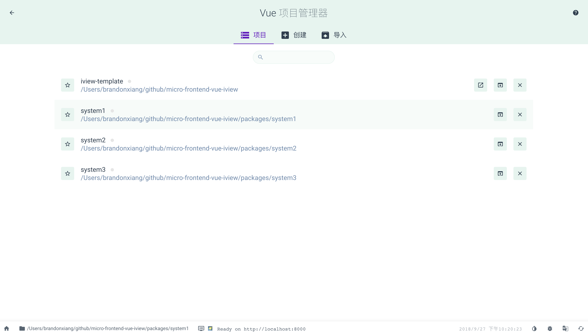

## Vue-Cli3.0

项伟平

2018年10月18日

----

## 1 回顾Vue-cli2.9.6

#### Vue和Webpack的框架

```shell
npm install -g vue-cli
vue init webpack .
```

----

### 问题一

- webpack.base.config.js
- webpack.dev.config.js
- webpack.prod.config.js
- <font color=#FF0000>webpack.test.config.js</font>

----

### 问题二

webpack的*loader*和*plugin*的区别

----

## 2 Vue-cli3.0的入门 

#### 2.1 安装


<font size=5>要求使用node8.0以上[官方文档](https://cli.vuejs.org/zh/)</font>

```shell
npm install -g @vue/cli
vue create .
```
----

#### 2.2 兼容2.0模版

```shell
npm install -g @vue/cli-init
vue init webpack .
```

----

#### 2.3 配置文件

> <font size=5>Vue 3.0支持是否拆分配置文件</font>

2.0框架 | 3.0框架
---- | ----
webpack.config.js | vue.config.js
babelrc.js | babel.config.js
postcssrc.js |
eslintrc.js | 

----

#### 2.4 多页面的支持

><font size=5>Vue CLI 支持使用 vue.config.js 中的 pages 选项构建一个多页面的应用</font>

```javascript
module.exports = {
  pages: {
    index: {
      // page 的入口
      entry: 'src/index/main.js',
      // 模板来源
      template: 'public/index.html',
      // 在 dist/index.html 的输出
      filename: 'index.html',
      // 当使用 title 选项时，
      // template 中的 title 标签需要是 <title><%= htmlWebpackPlugin.options.title %></title>
      title: 'Index Page',
      // 在这个页面中包含的块，默认情况下会包含
      // 提取出来的通用 chunk 和 vendor chunk。
      chunks: ['chunk-vendors', 'chunk-common', 'index']
    },
    // 当使用只有入口的字符串格式时，
    // 模板会被推导为 `public/subpage.html`
    // 并且如果找不到的话，就回退到 `public/index.html`。
    // 输出文件名会被推导为 `subpage.html`。
    subpage: 'src/subpage/main.js'
  }
}
```

----


#### 2.4 多页面的支持

><font size=5>简化配置项</font>

```javascript
module.exports = {
  pages: {
    index: 'src/modules/index/main.js',
    subpage: 'src/modules/subpage/main.js',
  }
}
```

----


#### 2.5 插件

><font size=5>Vue CLI 使用了一套基于插件的架构，它可以让社区根据常见需求构建和共享可复用的解决方案。</font>


- 便于扩展,利于维护
- 解耦
- 易安装
- 便于更新

----

#### 举例

@vue/cli-plugin-pwa

```shell
vue add @vue/pwa
```

----

#### 2.6 webpack相关(举例一)

```javascript
// vue.config.js
module.exports = {
  configureWebpack: {
    plugins: [
      new MyAwesomeWebpackPlugin()
    ]
  }
}
```

----

#### 2.6 webpack相关(举例二)

```javascript
module.exports = {
  chainWebpack: config => {
    config.module
    .rule('ejs')
    .test(/\.ejs$/)
    .use('ejs')
      .loader('ejs-compiled-loader')
  }

}
```
----

#### 2.7 vue-ui



----

#### 2.7 vue-ui

- 项目管理
- 插件管理
- 依赖管理（运行依赖，开发依赖）
- 配置（vue Cli，ESLINT，PWA）
- 任务（npm script）

----

## 3 case study

----

## 4 总结

- 对比vue-cli3和2
- Vue-cli3.0入门
  - 安装
  - 兼容2.0模版
  - 插件
  - 配置
  - vue-ui
- case study

----


#### 问题

- dependencies
- devDependencies
- peerDependencies
- optionalDependencies
- bundledDependencies


