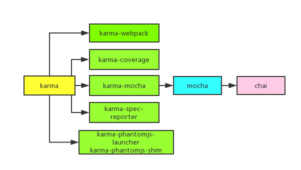

## Vue单元测试


项伟平

2017年11月8日

----


https://github.com/brandonxiang
https://github.com/PaicFE

----

**为什么需要自动化测试？**

----

**什么是持续集成？它和持续部署有什么区别？**

----

> <small>持续集成的目的，就是让产品可以快速迭代，同时还能保持高质量。它的核心措施是，代码集成到主干之前，必须通过自动化测试。只要有一个测试用例失败，就不能集成。

> --[持续集成是什么](http://www.ruanyifeng.com/blog/2015/09/continuous-integration.html)</small>


----

Confidence to Change / Removal of Fear +
High Code Quality +
Well-Documented Code =
**Developer Happiness**

> [great presentation by Matt O'Connell](http://slides.com/mattoconnell/deck#/)

----

#### Vue官方单元测试

- e2e测试（NightWatch）
- 单元测试（Karma）

----

#### e2e测试（NightWatch）

- [NightWatch](https://github.com/nightwatchjs/nightwatch) + ChromeDriver（Phantomjs）
- [puppeteer](GoogleChrome/puppeteer) + [chromeless](https://github.com/graphcool/chromeless)

---- 

```
module.exports = {
  'default e2e tests': function test(browser) {
    const devServer = browser.globals.devServerURL;

    browser
    .url(devServer)
    .waitForElementVisible('#app', 5000)
    .assert.elementPresent('.hello')
    .assert.containsText('h1', 'Welcome to Your Vue.js App')
    .assert.elementCount('img', 1)
    .end();
  },
};
```

<small>常用使用场景：自动填报表单</small>

---- 

#### 单元测试（Karma）



----

<small>karma是一个专门的测试运行器（runner），它不是一个测试框架框架，也不是以一个断言库，是一个平台</small>

- [karma-webpack](https://github.com/webpack-contrib/karma-webpack) 用webpack预处理文件
- [karma-coverage](https://github.com/karma-runner/karma-coverage) 测试覆盖率
- [karma-mocha](https://github.com/karma-runner/karma-mocha) 接入mocha测试框架
- [karma-spec-reporter](https://github.com/mlex/karma-spec-reporter) 输出报告
- [karma-phantomjs-launcher](https://github.com/karma-runner/karma-phantomjs-launcher) 控制PhantomJS
- [karma-phantomjs-shim](https://github.com/tschaub/karma-phantomjs-shim) 给PhantomJS兼容的控制

----

#### Mocha

<small>mocha本身只是一个单元测试框架，可以兼容第三方断言库</small>

   - [should.js](https://github.com/shouldjs/should.js)
   - [expect.js](https://github.com/LearnBoost/expect.js)
   - [chai](http://chaijs.com/)
   - [better-assert](https://github.com/visionmedia/better-assert)
   - [unexpected](http://unexpected.js.org/)

----

#### Mocha语法

```javascript

import Vue from 'vue';
import Hello from '@/components/Hello';

describe('Hello.vue', () => {
  it('should render correct contents', () => {
    const Constructor = Vue.extend(Hello);
    const vm = new Constructor().$mount();
    expect(vm.$el.querySelector('.hello h1').textContent)
      .to.equal('Welcome to Your Vue.js App');
  });
});
```

<small>测试用例写在specs（specifications）文件底下</small>

----

#### Chai语法

```javascript
var expect = require('chai').expect
  , foo = 'bar'
  , beverages = { tea: [ 'chai', 'matcha', 'oolong' ] };

expect(foo).to.be.a('string');
expect(foo).to.equal('bar');
expect(foo).to.have.lengthOf(3);
expect(beverages).to.have.property('tea').with.lengthOf(3);
```

----

#### vue-test-utils

> 官方测试库
> https://vue-test-utils.vuejs.org

- Shallow 只挂载一个组件而不渲染其子组件
- mount 返回第一个 DOM 节点或匹配选择器的 Vue 组件

----

### 使用方法

```javascript
import { shallow } from 'vue-test-utils'
import { expect } from 'chai'
import Foo from './Foo.vue'

describe('Foo', () => {
  it('渲染一个 div', () => {
    const wrapper = shallow(Foo, {
      propsData: {
        color: 'red'
      }
    })
    expect(wrapper.hasProp('color', 'red')).toBe(true)
  })
})
```

----

#### 和Getters一起使用

```javascript
import { shallow, createLocalVue } from 'vue-test-utils'
import Vuex from 'vuex'
import Actions from '../../../src/components/Getters'

const localVue = createLocalVue()

localVue.use(Vuex)

describe('Getters.vue', () => {
  let getters
  let store

  beforeEach(() => {
    getters = {
      clicks: () => 2,
      inputValue: () => 'input'
    }

    store = new Vuex.Store({
      getters
    })
  })

  it('在第一个 p 标签中渲染“state.inputValue”', () => {
    const wrapper = shallow(Actions, { store, localVue })
    const p = wrapper.find('p')
    expect(p.text()).toBe(getters.inputValue())
  })

  it('在第二个 p 标签中渲染“state.clicks”', () => {
    const wrapper = shallow(Actions, { store, localVue })
    const p = wrapper.findAll('p').at(1)
    expect(p.text()).toBe(getters.clicks().toString())
  })
})
```

----

Q&A

